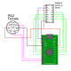
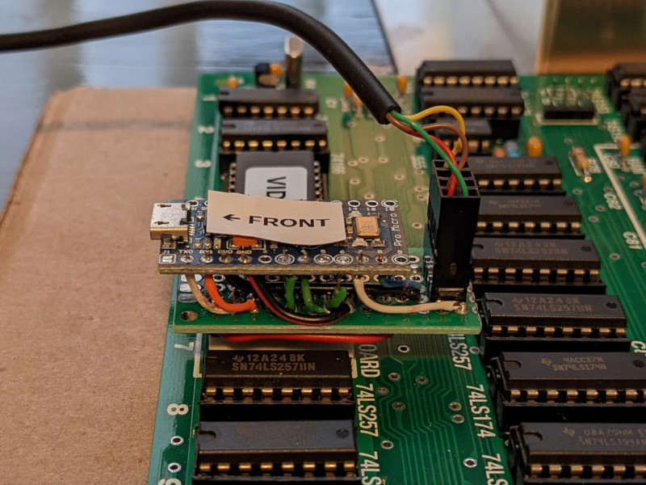

# Apple II Keyboard Adapter

This is a simple Arduino project to allow connecting a PS/2 keyboard to the
16 pin DIP keyboard connector on an Apple II. I've tested it on a
ReactiveMicro reproduction Apple II+ RFI logic board and it works great.

All keys are mapped to modern keyboard equivalents and the Apple can be
reset with the Ctrl-PrtScrn key combo.

Parts list:
 1. Arduino. I used a cheap Arduino Pro Micro clone from Amazon but
    you could probably adapt to use whatever you have on hand.
 2. Female PS/2 connector
 3. 2 8-pin male machine pin headers, or some other connector for the
    DIP-16 socket on the logic board.

_Warning_: The DIP-16 connector on the logic board does have some pins with
higher voltages that will destroy your Arduino if you accidentally connect to
them, so take care.

### Prototype

The Arduino hole pattern is too wide for the DIP-16 socket so I used another
PCB to hold the machine pins and then jumpered the Arduino to the pins on top.
I also used a pin header to connect to a spare PS/2 connector from an old PC.

It's not so pretty, but it's compact and cost almost nothing.

